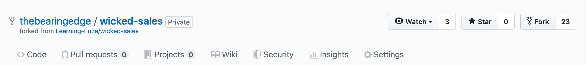

# wicked-sales

A full stack LAMP & React shopping cart app.

## Introduction

For this project, you will be building a single-page React application and a dynamic PHP API.

## Getting Started

1. Fork this repository to your GitHub account and clone the fork to your local `lfz` directory.
2. Check out a `dev` branch and push it to `origin`.
    ```
    git push origin dev
    ```
3. Install all dependencies in `package.json` with NPM.
    ```
    npm install
    ```
4. Add the `wicked-sales.localhost` site to Apache by copying the provided virtual host configuration in the `server` directory to `/etc/apache2/sites-available`.
    ```
    sudo cp server/wicked-sales.localhost.conf /etc/apache2/sites-available
    ```
5. Enable the `wicked-sales.locahost` site.
   ```
   sudo a2ensite wicked-sales.localhost
   ```
6. Restart the Apache web server.
   ```
   sudo service apache2 restart
   ```
7. Start `webpack-dev-server` running the provided `"dev"` script in `package.json`.
   ```
   npm run dev
   ```
8. Open a new terminal into your development environment to test that Webpack Dev Server and Apache are working together. Send a GET request to `localhost:3000/api/products.php`.
   ```
   http get localhost:3000/api/products.php
   ```
   You should receive `200 OK` response containing a JSON `Array` of products.

## Features

There are [Markdown](https://guides.github.com/features/mastering-markdown/) files located in the `features` directory of this project that contain useful links and task lists for each feature of the application.

For each Markdown file, create a new Issue on your fork's GitHub repository and paste the content of the Markdown file into the **first** comment box. Give the Issue a clear title (usually the heading at the top of the Markdown file).

It is possible that your fork does not have Issues enabled by default.



If you do not see an **Issues** tab at the top of your fork's page, then go to its **Settings** tab and check the box to enable **Issues**.


## A note about Issue numbers

GitHub automatically assigns Issue numbers when you open them. The numbers that GitHub gives your Issues are not meaningful in any way other than unique identification, so the order that you open Issues doesn't really matter. It _does_ matter what order you work on each feature for the project. The name of each Markdown file in `features` includes a number designating the order in which they should be implemented.

## A note about commit messages

As you work through each task of a given feature, make a commit. It's good to get into the habit of making incremental progress on a project. Each commit message that you write should be concise, but descriptive enough that another developer can guess what you did in the code without having to actually read the code.

## NPM Scripts

- `dev` - Start Webpack Dev Server at `localhost:3000`
- `build` - Run Webpack to build the React client into `server/public`.
