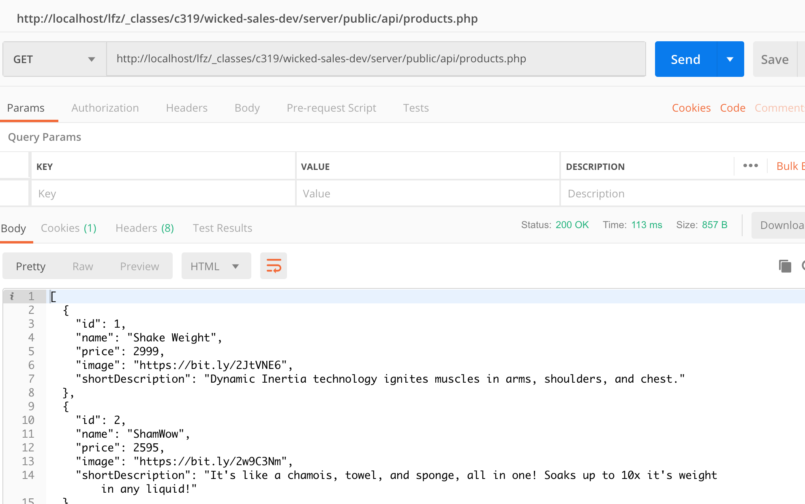
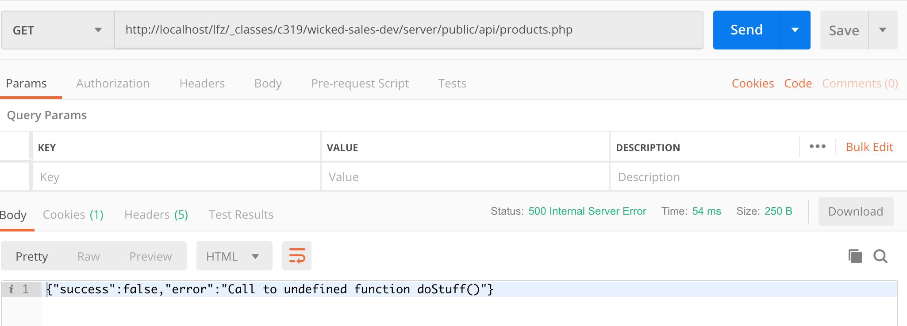

# Make initial products endpoint and deliver dummy data

1. navigate to your project's server/public/api/ folder
1. make a file, functions.php (we will visit this file a few times)
1. inside functions.php, create a function called "error_handler" that takes in a single parameter, error, and returns nothing.
1. inside error_handler, create an associative array called output
1. in output, add a key 'success' with a value of false
1. in output, add a key of 'error', and a value of the getMessage method of the error variable you passed into the function
1. Encode the output variable into JSON, and put the resulting string in json_output
1. print out the json_output variable
1. edit the file, products.php, comment out the code that is already there
1. in products.php, import the functions.php file.  Make sure it is required, and that it is only imported once.  hiiint hiiint.
1. in your products.php, set the exception handler to the function you made in your functions.php
1. use file_get_contents to grab the contents of the dummy data json file 'dummy-products_list.json', assign it to a variable called output
1. print the output file

#### postman endpoint example

1. cause an error by calling a non-existant function, doStuff.  See if you get an error output.  Make sure to do this AFTER the set_exeption_handler

#### postman endpoint example

- notice the status code 500 on the middle-right?