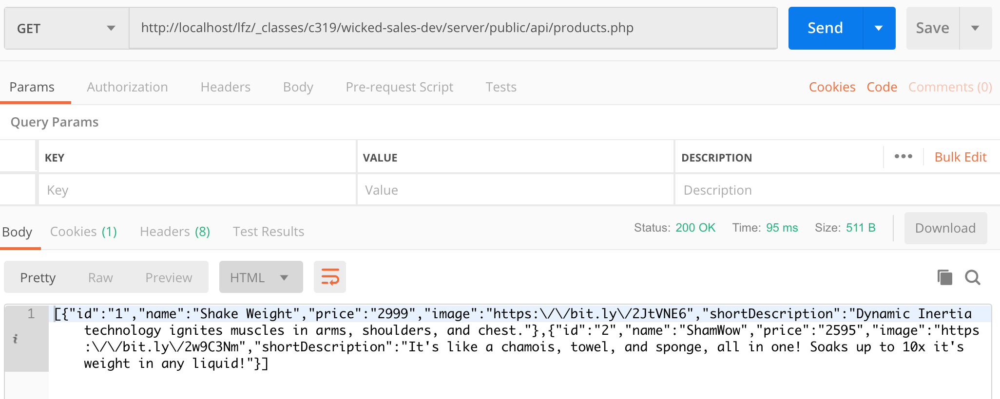
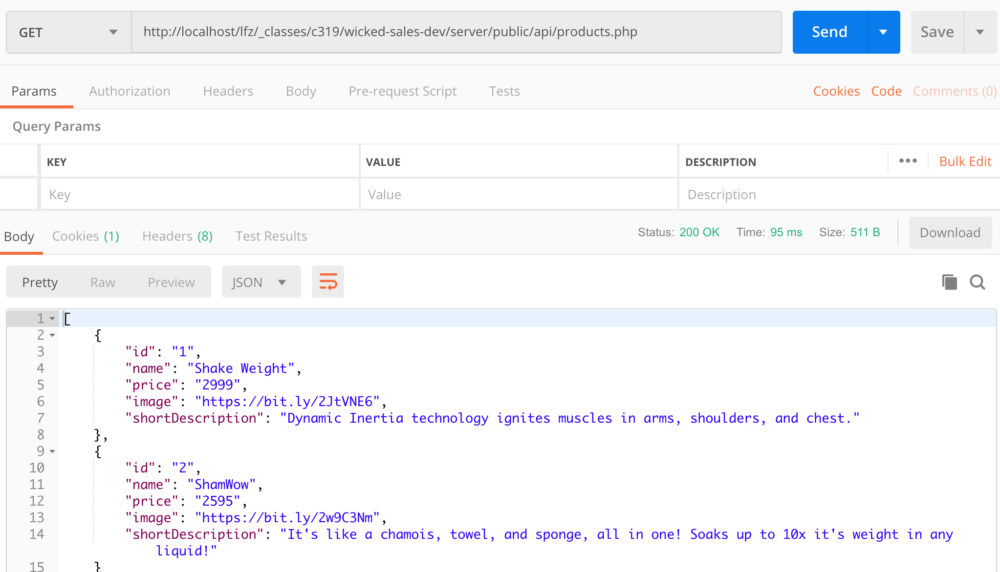
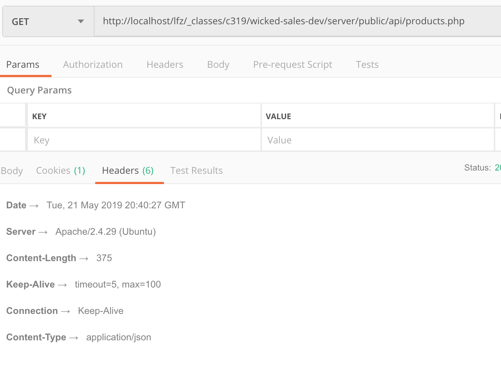

# connect to products table and fetch data

1. in your products.php file, put in your query and assign it to a variable, $query
1. make a variable, result.  Assign to it the result of a mysqli_query function call using your $conn variable and your $query
1. make a conditional that tests if result is not truthy.  If it is not, throw an exception and pass in a mysqli_error so you know what happened.
1. create an array variable, output
1. loop through the data coming from the result via mysqli_fetch_assoc
    - push it into the $output variable
1. after you are done with the loop
1. json encode the output data
1. print the json data
1. use postman to hit your endpoint and test the data is coming out correctly
    * raw output example: 
    * prettified output example: 
1. go to your functions.php file
1. add a function, startup
1. read up about sending [**headers**](header("Content-type:application/json");)
1. in the startup function, send the following header: 
    * "Content-type:application/json"
    * this will let the receiving client know that you are sending json data
1. in the top of your products.php file, after you set your error handler, call your startup function
1. in postman, check the headers you are receiving and see if you got the right one
    * 
    * 
