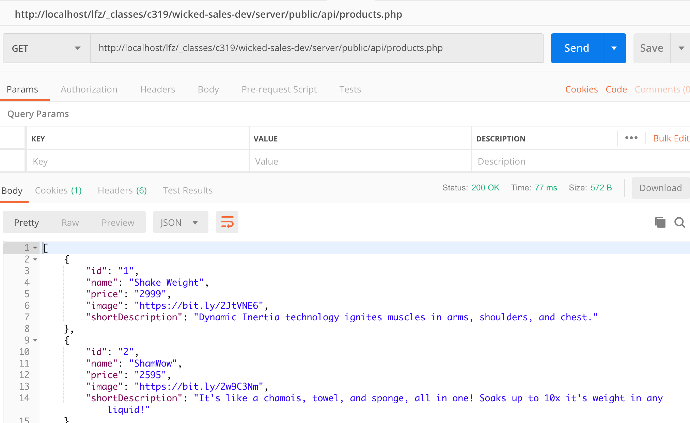
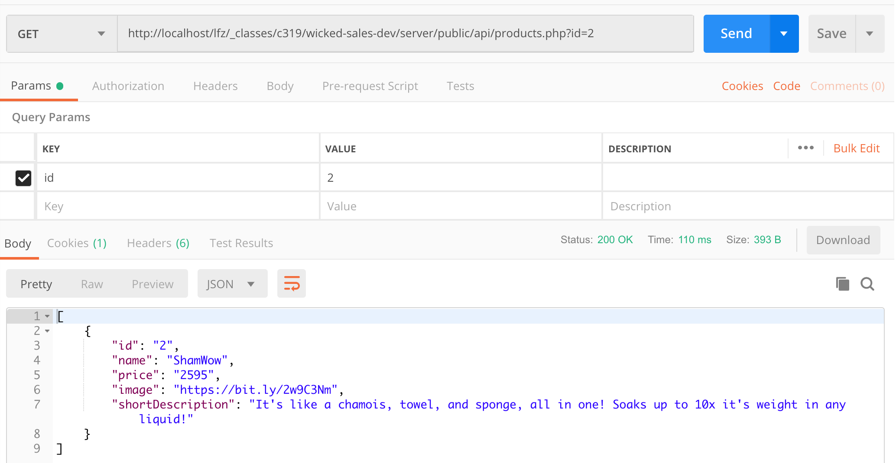
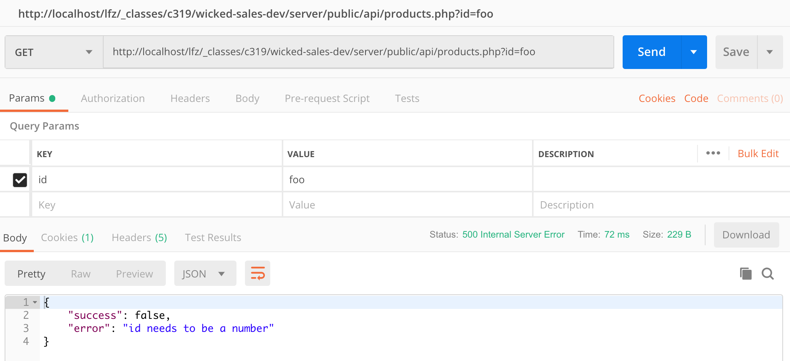
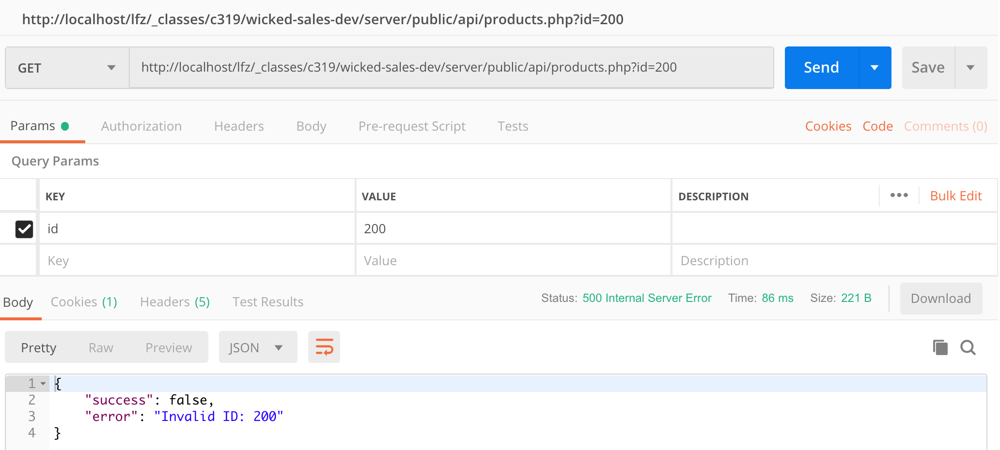

# connect to products table and fetch data

1. modify your products.php endpoint
1. make sure to make a new branch!  We might mess this up!
1. add the following below your error handler addition, before your $query
1. test if the query parameter "id" is empty or not
    * if it does:
        * make a variable called whereClause, add to it a mysql "WHERE" clause that will check if id in your products table is equal to a particular product
    * if it doesn't:
        * make a variable called whereClause that is an empty string.
1. concatenate the whereClause variable onto your query variable
1. OUTPUT looks like this
    * with no id 
    * with valid id 
1. do a pull request for this version.  Make sure to include proof that it works!
1. Notice that we said "valid".  We need to check if is a valid ID.  First, we need to test if it is a number
1. Go back to your check if id is empty or not
    * in the true part, check if $_GET['id'] is a number (how do you check for this in php?)
        * if it is not a number, throw an exception that says "id needs to be a number"
1. submit a pull request for this version with proof that it catches a non-number
    * 
1. one more possibility is that we select an ID that doesn't exist.  If there are no products when we look for any, we don't consider that an error for this endpoint.
1. however, if we gave an ID, and there was no product by that ID, that is an error.
1. If you have a num_rows check, or you after youa dd one, 
    * add a check to see if you have an ID sent to you from the client (like you used above).
    * if you do have an ID, and you have no data, throw an exception of "invalid ID: " and the ID that was requested
1. submit a pull request for this version
    * 